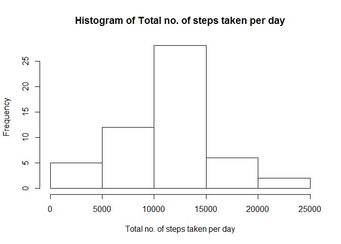
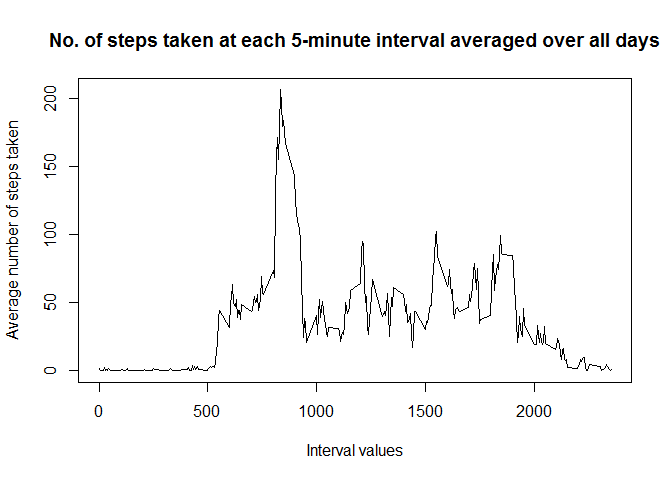
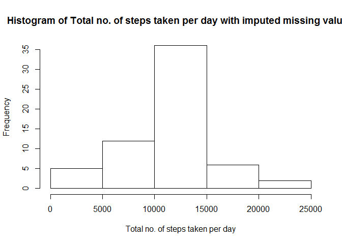
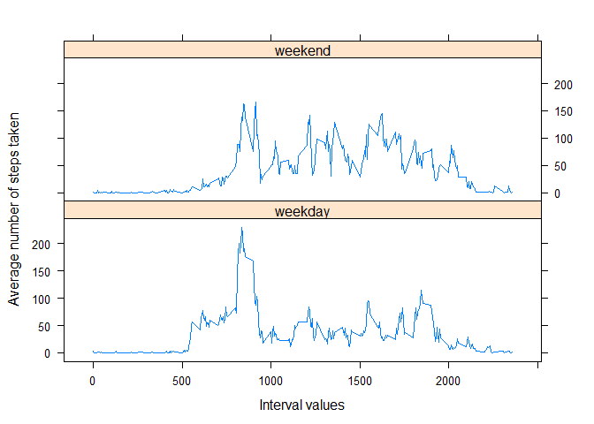

# Reproducible Research: Peer Assessment 1


## Loading and preprocessing the data
Assuming activity.csv is in the working directory:

```r
activity <- read.csv("activity.csv")
```

## What is mean total number of steps taken per day?

For this part we will ignore the missing values in the dataset.

```r
activityWONa <- na.omit(activity)
```
Let us plot a histogram of the total number of steps taken each day.

```r
aggregateSteps <- aggregate(activityWONa$steps, by=list(date=activityWONa$date), FUN=sum)

hist(aggregateSteps$x, xlab = "Total no. of steps taken per day",
     main = "Histogram of Total no. of steps taken per day")
```

 

Mean total number of steps taken per day:

```r
mean(aggregateSteps$x)
```

```
## [1] 10766.19
```

Median total number of steps taken per day:

```r
median(aggregateSteps$x)
```

```
## [1] 10765
```

## What is the average daily activity pattern?
Let's make a time series plot (i.e. type = "l") of the 5-minute interval (x-axis) and the average number of steps taken, averaged across all days (y-axis)

```r
averageAtIntervals <- aggregate(activityWONa$steps, by=list(interval=activityWONa$interval), FUN="mean")
plot(averageAtIntervals$interval, averageAtIntervals$x, 
     type="l", xlab = "Interval values", ylab = "Average number of steps taken",
     main = "No. of steps taken at each 5-minute interval averaged over all days")
```

 

Let us see which 5-minute interval, on average across all the days in the dataset, contains the maximum number of steps

```r
maxStepInterval <- averageAtIntervals[averageAtIntervals$x==max(averageAtIntervals$x),]
colnames(maxStepInterval)[2] <- "mean"
maxStepInterval
```

```
##     interval     mean
## 104      835 206.1698
```
## Imputing missing values
There are a number of days/intervals where there are missing values (coded as NA). The presence of missing days may introduce bias into some calculations or summaries of the data.
Let's calculate and report the total number of missing values in the dataset (i.e. the total number of rows with NAs)

```r
sum(is.na(activity))
```

```
## [1] 2304
```

Simple strategies to fill these missing values can include using the mean/median for that day, or the mean for that 5-minute interval, etc.
Here we use the mean for that 5-minute interval.

```r
imputedActivity <- activity 
for (i in 1:nrow(imputedActivity)) {
    if (is.na(imputedActivity$steps[i])) {
        imputedActivity$steps[i] <- averageAtIntervals[which(imputedActivity$interval[i] == averageAtIntervals$interval), ]$x
    }
}
```

Now we have a new dataset that is equal to the original dataset but with the missing data filled in. Let's verify that:

```r
sum(is.na(imputedActivity))
```

```
## [1] 0
```

Let's make a histogram of the total number of steps taken each day and Calculate and report the mean and median total number of steps taken per day.

```r
aggregateStepsImputedActivity <- aggregate(imputedActivity$steps, by=list(date=imputedActivity$date), FUN=sum)

hist(aggregateStepsImputedActivity$x, xlab = "Total no. of steps taken per day",
     main = "Histogram of Total no. of steps taken per day with imputed missing values")
```

 

Mean total number of steps taken per day:

```r
mean(aggregateStepsImputedActivity$x)
```

```
## [1] 10766.19
```

Median total number of steps taken per day:

```r
median(aggregateStepsImputedActivity$x)
```

```
## [1] 10766.19
```

#Comparing with the mean and median of the data from the before imputing missing values
Mean and Median before imputing missing values:

```r
mean(aggregateSteps$x)
```

```
## [1] 10766.19
```

```r
median(aggregateSteps$x)
```

```
## [1] 10765
```
Mean and Median after imputing missing values:

```r
mean(aggregateStepsImputedActivity$x)
```

```
## [1] 10766.19
```

```r
median(aggregateStepsImputedActivity$x)
```

```
## [1] 10766.19
```
So we can see as a result of imputing using the means of the 5-minute intervals the mean value of the total number of steps taken per day has not changed but the median value has increased.

## Are there differences in activity patterns between weekdays and weekends?
For this part, we will use the dataset with the filled-in missing values.
Let us create a new factor variable in the dataset with two levels - "weekday" and "weekend" indicating whether a given date is a weekday or weekend day.

```r
library(plyr)
library(chron)
imputedActivity$dayType <- as.factor(is.weekend(imputedActivity$date))
imputedActivity$dayType <- revalue(imputedActivity$dayType, c("FALSE"="weekday", "TRUE"="weekend"))
```

Let us make a panel plot containing a time series plot (i.e. type = "l") of the 5-minute interval (x-axis) and the average number of steps taken, 
averaged across all weekday days or weekend days (y-axis). 

```r
aggregateAveragedOverIntervalWeekDay <- aggregate(imputedActivity$steps, 
                                        list(interval = as.numeric(as.character(imputedActivity$interval)), 
                                             dayType  = imputedActivity$dayType),
                                        FUN = "mean")

library(lattice)
xyplot(aggregateAveragedOverIntervalWeekDay$x ~ aggregateAveragedOverIntervalWeekDay$interval | 
           aggregateAveragedOverIntervalWeekDay$dayType, 
       layout = c(1, 2), type = "l", 
       xlab = "Interval values", ylab = "Average number of steps taken")
```

 
